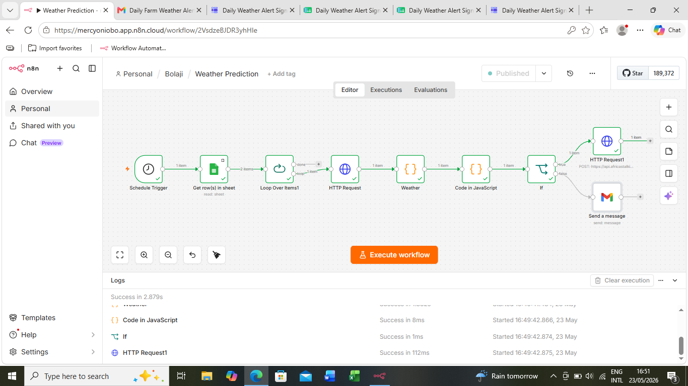

# 🌦️ Localized Weather Alert System for Farmers

An n8n workflow that fetches daily weather forecasts and sends 
personalized alerts to crop and livestock farmers in their 
preferred language — automatically, every single day.

Built by someone who studied agriculture and learned automation. 
This one is personal.

---

## The Problem
Farmers make critical daily decisions based on weather — when to 
plant, when to irrigate, when to move livestock. But most weather 
tools are in English, technical, and not built with them in mind.

## What This Workflow Does
- Runs automatically every day via a schedule trigger
- Pulls farmer data (contacts, type, language preference) from 
  Google Sheets
- Fetches real-time weather data from the OpenWeatherMap API
- Identifies whether each farmer is a crop or livestock farmer
- Tailors the alert message accordingly using JavaScript
- Sends each farmer their alert in their preferred language via Gmail

## Supported Languages
🇬🇧 English | Yoruba | Igbo | Hausa

## Nodes Used
Schedule Trigger → Google Sheets (Get Rows) → Loop Over Items 
→ HTTP Request → JavaScript Code → IF → Gmail

## Tools & Integrations
- n8n (workflow automation)
- OpenWeatherMap API
- Google Sheets
- Gmail

## Why It Matters
This workflow doesn't just send weather data — it sends the 
*right* message, to the *right* farmer, in the *right* language. 
No manual work. No missed alerts.
